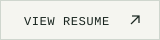
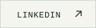
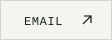
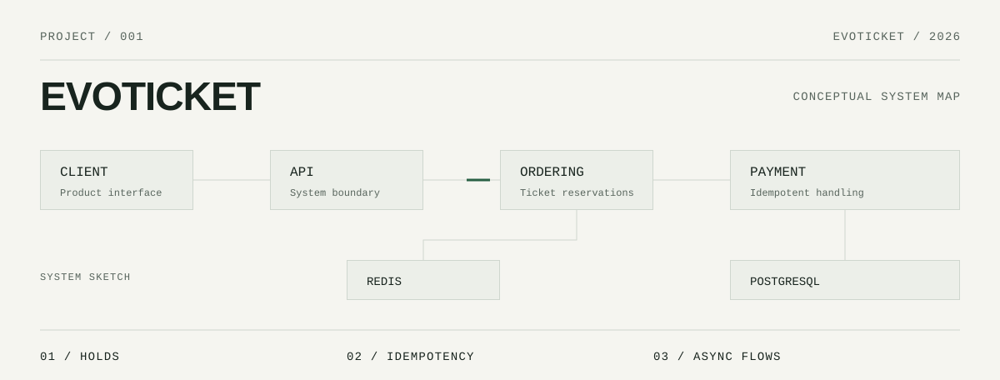

<picture>
  <source media="(prefers-color-scheme: dark)" srcset="./assets/hero/hero-dark.svg">
  <source media="(prefers-color-scheme: light)" srcset="./assets/hero/hero-light.svg">
  
</picture>

<!-- Replace the example.com links below with your real destinations. -->

  <a href="https://example.com/portfolio"><picture><source media="(prefers-color-scheme: dark)" srcset="./assets/buttons/portfolio-dark.svg"><source media="(prefers-color-scheme: light)" srcset="./assets/buttons/portfolio-light.svg"></picture></a>
  <a href="https://example.com/resume.pdf"><picture><source media="(prefers-color-scheme: dark)" srcset="./assets/buttons/resume-dark.svg"><source media="(prefers-color-scheme: light)" srcset="./assets/buttons/resume-light.svg"></picture></a>
  <a href="https://www.linkedin.com/in/ph%C3%BAc-nguy%E1%BB%85n-l%C3%AA-ho%C3%A0ng-ab1702337"><picture><source media="(prefers-color-scheme: dark)" srcset="./assets/buttons/linkedin-dark.svg"><source media="(prefers-color-scheme: light)" srcset="./assets/buttons/linkedin-light.svg"></picture></a>
  <a href="mailto:nguyenlehoangphuc707@gmail.com"><picture><source media="(prefers-color-scheme: dark)" srcset="./assets/buttons/email-dark.svg"><source media="(prefers-color-scheme: light)" srcset="./assets/buttons/email-light.svg"></picture></a>

I’m Phúc. I build backend systems and product-focused software, with attention to system boundaries, reliability, and clear engineering decisions.

## 01 / Selected Work

<picture>
  <source media="(prefers-color-scheme: dark)" srcset="./assets/projects/evoticket-dark.svg">
  <source media="(prefers-color-scheme: light)" srcset="./assets/projects/evoticket-light.svg">
  
</picture>

### EvoTicket

A ticketing platform for primary purchasing, controlled resale, ownership tracking, and event admission.

**System** — Microservices · PostgreSQL · Redis\
**Engineering** — Time-bounded holds · idempotent payments · asynchronous processing · dynamic QR check-in\
**Validation** — Load and spike testing with k6

<!-- Replace these example.com links with the repo and its supporting evidence. The cover is a conceptual sketch, not a verified deployment diagram. -->
[SOURCE](https://example.com/evoticket/source) · [ARCHITECTURE](https://example.com/evoticket/architecture) · [TEST REPORTS](https://example.com/evoticket/tests) · [CASE STUDY](https://example.com/evoticket/case-study)

## 02 / Currently

**Building** — EvoTicket architecture rebuild\
**Focusing** — Java · Spring Boot\
**Studying** — Distributed systems and application architecture

## 03 / Engineering

| Area | Working set |
| :--- | :--- |
| **Backend** | Java · Spring Boot · REST APIs · Microservices |
| **Data** | PostgreSQL · Redis |
| **Interfaces** | TypeScript · React · Next.js |
| **Delivery** | Docker · Git · k6 |

## 04 / Elsewhere

[Portfolio](https://example.com/portfolio) · [Résumé](https://example.com/resume.pdf) · [LinkedIn](https://www.linkedin.com/in/ph%C3%BAc-nguy%E1%BB%85n-l%C3%AA-ho%C3%A0ng-ab1702337) · [Email](mailto:nguyenlehoangphuc707@gmail.com)

---

NLHP / 2026 · Backend systems & product engineering
