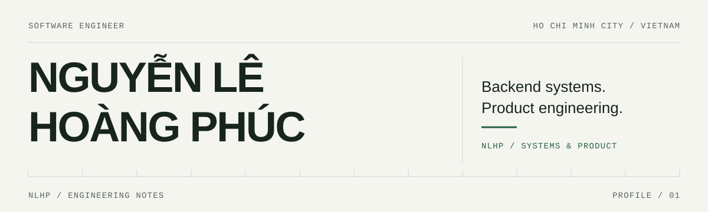

<picture>
  <source media="(prefers-color-scheme: dark)" srcset="./assets/hero-dark.svg">
  <source media="(prefers-color-scheme: light)" srcset="./assets/hero-light.svg">
  
</picture>

I’m Phúc, a software engineer focused on backend systems and product engineering.
Here you’ll find the code, system decisions, and tests behind my work.

## 01 / Selected Work

### EvoTicket

A ticketing platform covering event discovery, purchasing, official resale, ticket ownership, and admission. Currently being rebuilt around microservices.

**Engineering focus** — Time-bounded reservations, idempotent payment handling, asynchronous processing, and dynamic QR check-in.

**Stack** — Java · Spring Boot · Next.js · PostgreSQL · Redis · Docker

**Validation** — Critical flows tested with k6 load and spike scenarios.

Repository: `TODO: EVOTICKET_REPO_URL` · Architecture & test reports: `TODO: EVOTICKET_DOCS_URL`

<!-- Replace these plain-text placeholders with real links. Add numerical results only alongside a report describing workload, environment, and scope. -->

**02 / Project slot** — `TODO: PROJECT_02_NAME` · One sentence on the problem, your contribution, and a repository link.

**03 / Project slot** — `TODO: PROJECT_03_NAME` · One sentence on a distinct engineering strength and a repository link.

<!-- Candidate for slot 02: Student Smart Printing Service (2024), https://github.com/trlocne/CO3001_Software_Engineering. Confirm which contributions are yours and that the repo is ready to highlight. Delete unused slots before publishing a polished version. -->

## 02 / Currently

Rebuilding **EvoTicket**, with attention to consistency in concurrent purchase flows and validation through load testing.

<!-- Review this sentence when project status changes; keep this section to one or two current priorities. -->

## 03 / Engineering

| Area | Tools & practice |
| :--- | :--- |
| Backend | Java, Spring Boot, REST APIs, microservices |
| Data | PostgreSQL, MySQL, Redis |
| Product interfaces | TypeScript, React, Next.js |
| Development & validation | Docker, Git, Linux, Postman, k6 |

<!-- Keep only tools you can explain through actual work. Architecture tradeoffs, setup instructions, tests, and limitations belong in each project's README/docs. -->

## 04 / Lab & Open Source

  
Experiments & older work — to be curated

`TODO: LAB_OR_CONTRIBUTION_URL` — Add a small experiment or contribution with a clear question, your change, and a reproducible result.

<!-- Optional section: remove it until you have work to show. Keep 3–5 entries at most; do not collapse the flagship project. -->

## 05 / Elsewhere

[Email](mailto:nguyenlehoangphuc707@gmail.com) · [LinkedIn](https://www.linkedin.com/in/ph%C3%BAc-nguy%E1%BB%85n-l%C3%AA-ho%C3%A0ng-ab1702337)

Portfolio: `TODO: PORTFOLIO_URL` · CV: `TODO: CV_URL`

<!-- Portfolio = case-study storytelling. CV = qualifications. This profile = engineering proof. Replace the TODO labels with links; omit unavailable destinations rather than linking to dummy URLs. -->
